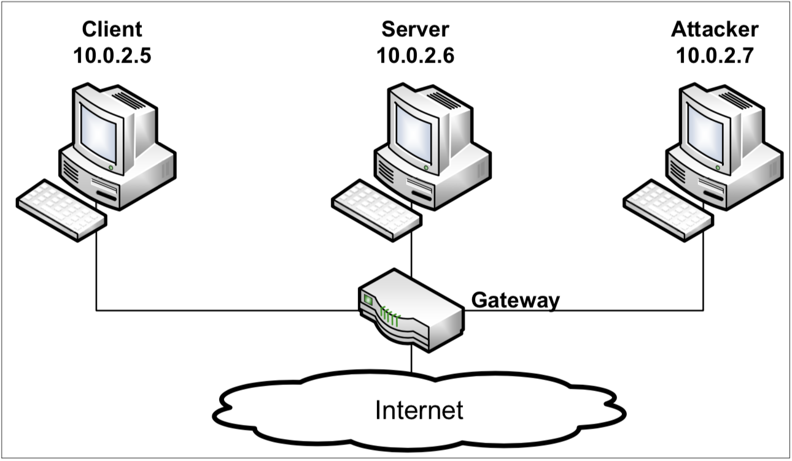

## {{page.title}}
{:.titletext}
SEED Lab: A Hands-on Lab for Security Education
{:.subtitletext}

### Overview

The learning objective of this lab is for students to gain first-hand experience on vulnerabilities, as well as on attacks against these vulnerabilities.
Wise people learn from mistakes.
In security education, we study mistakes that lead to software vulnerabilities.
Studying mistakes from the past not only help students understand why systems are vulnerable, why a "seemly-benign" mistake can turn into a disaster, and why many security mechanisms are needed.
More importantly, it also helps students learn the common patterns of vulnerabilities, so they can avoid making similar mistakes in the future.
Moreover, using vulnerabilities as case studies, students can learn the principles of secure design, secure programming, and security testing.

The vulnerabilities in the TCP/IP protocols represent a special genre of vulnerabilities in protocol designs and implementations;
they provide an invaluable lesson as to why security should be designed in from the beginning, rather than being added as an afterthought.
Moreover, studying these vulnerabilities help students understand the challenges of network security and why many network security measures are needed.

###### Suggested Reading/Resources

- Chapter 16 in {{ site.data.settings.textbook }}
- [Netwox examples](http://www.cis.syr.edu/~wedu/seed/Labs/Lab_Setup/netw522/netwox-doc_html/html/examples.html) + [Netwox/Netwag Troubleshooting guide](http://www.cis.syr.edu/~wedu/seed/Documentation/Misc/netwox.pdf)

### Tasks
{:.titletext}
This lab has been tested on the pre-built [SEEDUbuntu16.04 VM](https://seedsecuritylabs.org/lab_env.html).
{:.subtitletext}
<!-- - The complete description of tasks for this lab can be found in the PDF write-up: **[{{page.title}}]({{page.localurl}})**. -->

For this lab, please feel free to use any of the tools we've discussed in class or learned about in the textbook, including: scapy, netwox/netwag, wireshark.

You can find the code we covered related to this lab on GitHub:
[**csci476-code/16_tcp_attacks/**](https://github.com/traviswpeters/csci476-code/tree/master/16_tcp_attacks)

#### Network Setup

To conduct this lab, students need to have at least 3 machines.
One computer is used as the **attacker**, the second computer is used as the **victim** (e.g., server), and the third computer is used as an **observer** (e.g., client).
Students can set up 3 virtual machines on the same host computer, or they can set up 2 virtual machines, and then use the host computer as the third computer.

For this entire lab, we put all these three machines on the same LAN.
An example configuration is shown in the following figure.

<center>

</center>

We assume that attackers are on the same physical network as the victims.
(This simplifies the task of determining TCP sequence numbers and source port numbers.)
You can use sniffer tools to collect the necessary information.
The following is the list of attacks that need to be implemented.

#### Task 1: SYN Flooding Attack

In this task, you need to demonstrate that you can carry out a SYN flooding attack.
You can use the `netwox` tool to conduct the attack, and then use a sniffer tool to capture the attacking packets.
While the attack is going on, run the `netstat -na` command on the victim machine,
and compare the result with that before the attack.
Please also describe how you know whether the attack has been successful or not.

**Hints:**

```bash
# check the size of the queue for holding half-open connections
sudo sysctl -q net.ipv4.tcp_max_syn_backlog

# check the current usage of the queue;
# i.e., the number of half-open connections associated with some listening port
netstat -na

# one netwox took that may be useful is tool number 76:
netwox 76 --help
```

**SYN Cookie Countermeasure:**
If it seems your attack is unsuccessful, one thing that you can investigate is whether the **SYN cookie** mechanism is turned on.
The SYN cookie is a defense mechanism to counter the SYN flooding attack.
The mechanism will kick in if the machine detects that it is under the SYN flooding attack.

For this lab, it is acceptable to disable the SYN cookie countermeasure.
You can use the `sysctl` command to turn on/off the SYN cookie mechanism:

```bash
sudo sysctl -a | grep cookie                 # Display the SYN cookie flag
sudo sysctl -w net.ipv4.tcp_syncookies=0     # turn off SYN cookie
sudo sysctl -w net.ipv4.tcp_syncookies=1     # turn on  SYN cookie
```

**Note on Scapy:**
Although theoretically, we can use Scapy for this task, we have observed that the number of packets sent out by Scapy per second is much smaller than that by the `netwox` tool.
This low rate makes it difficult for the attack to be successful.
We were not able to succeed in SYN flooding attacks using Scapy.

#### Task 2: TCP RST Attacks on Existing Connections

In each of the following subtasks you will carry out a TCP RST attack on existing connections over various types of protocols, which run over TCP connections.

**Hints:** You may use `netwox 78`, or any of the code from our course repo (e.g., `reset.py`, `reset_auto.py`) to help you conduct this attack.

###### Task 2A: TCP RST Attacks on telnet Connections
In this task, you need to launch a TCP RST attack to break an existing **telnet** connection between A and B.

###### Task 2B: TCP RST Attacks on ssh Connections
In this task, you need to launch a TCP RST attack to break an existing **ssh** connection between A and B.

###### Task 2C: TCP RST Attacks on Video Streaming Connections --- (Extra Credit)
In this task, you need to launch a TCP RST attack to break an existing **video streaming** connection between A and B.
_**This task is extra credit.**_

**Clarifications for Task 2C:**
- We assume that the attacker and the victim are on the same LAN.
- The victim browses for a video content in some video-streaming website, and selects one of the videos for streaming.
- After the victim selects a video, a TCP session will be established between the victim machine and the content server for the video streaming. (You should verify with, e.g., wireshark)
- _**Your task**_ is to disrupt the video streaming by breaking the TCP connection between the victim and the content server.
You can let the victim browse the video-streaming site from another (virtual) machine or from the same (virtual) machine as the attacker.

<p class="text-center text-danger">
Please be noted that, to avoid liability issues, any attacking packets should be targeted at the victim machine (which is the machine run by yourself),
not at the content server machine (which does not belong to you).
You only need to use Netwox for this task.
</p>

#### Task 3: TCP Session Hijacking

In this task, you need to demonstrate how you can hijack a telnet session between two computers.
Your goal is to get the the telnet server to run a malicious command from you.

**Hints:** You may use `netwox 40`, or any of the code from our course repo (e.g., `sessionhijack.py`) to help you conduct this attack.
You may use wireshark, tcpdump, or your own custom sniffer to observe the TCP values needed for the packet(s) you craft and inject.

> **NOTE:** It should be noted in the TCP session hijacking section of the SEED book, the command listed there does not set all the fields of the TCP and IP headers. The fields that are not set will use the default value provided by netwox. Those default values work for Ubuntu 12.04, but some of them do not work for Ubuntu 16.04. If you use the SEED book as a reference, you need to set those fields accordingly, instead of using the default. See `netwox 40 --help` for more details about the parameters you need to set.

In the netwox command above, the **tcp-data** part only takes hex data.
If we want to inject a command string, which is typically represented as a human-readable ASCII string, we need to convert it into a hex string.
There are many ways to do that, but I recommend a very simple command in Python.
In the following, we convert an ASCII string "Hello World" to a hex string (the quotation marks are not included).

```python
$ python
>>> "Hello World".encode("hex")
’48656c6c6f20576f726c64’
```

#### Task 4: Creating a Reverse Shell using TCP Session Hijacking

In this task, you need to demonstrate how you can hijack a telnet session between two computers.
Your goal is to get the the telnet server to create a reverse shell.

To be clear, your task is to launch a TCP session hijacking attack _on an existing telnet session_ between a user and the target server.
You need to inject your malicious command into the hijacked session, so you can get a reverse shell on the target server.
I recommend you use scapy for this task.

**NOTE:**
You may first test your reverse shell payload on the victim's machine in a normal shell.
To complete this task, however, you must deliver the reverse shell command as payload in an injected TCP packet.

**REMINDER:**
We explored reverse shells in _Lab 02: Shellshock Attack Lab_, and learned about them in class (recall slides from Week 3).

### Submission

You should submit a lab report. The report should cover the following sections:
- **Design:** The design of your attacks, including the attacking strategies, the packets that you use in your attacks, the tools that you used, etc.
- **Observations and Explanations:** Is your attack successful? How do you know whether it has succeeded or not? What do you expect to see? What have you observed? Is the observation a surprise to you?
