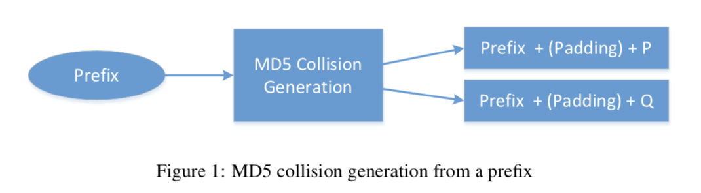
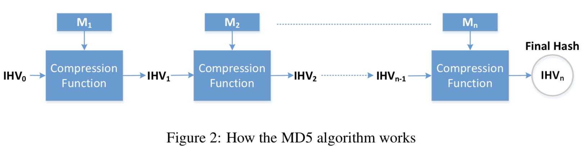
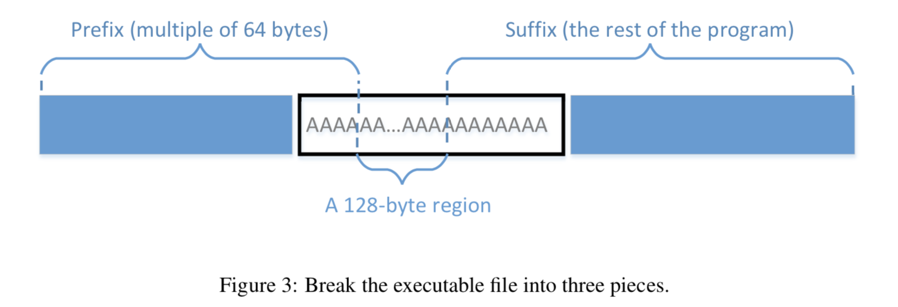
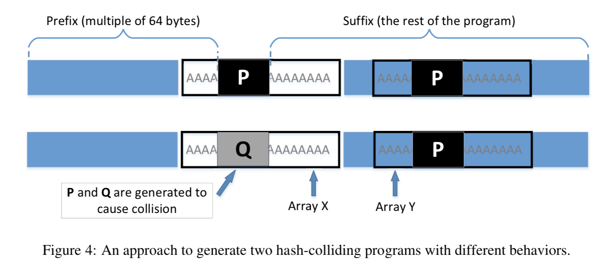

## {{page.title}}
{:.titletext}
SEED Lab: A Hands-on Lab for Security Education
{:.subtitletext}

### Overview

A secure one-way hash function needs to satisfy two properties: (1) the one-way property and (2) the collision-resistance property.
The _**one-way property**_ ensures that given a hash value $$h$$, it is computationally infeasible to find an input $$M$$, such that $$hash(M) = h$$.
The _**collision-resistance property**_ ensures that it is computationally infeasible to find two different inputs $$M_1$$ and $$M_2$$, such that $$hash(M_1) = hash(M_2)$$.

Several widely-used one-way hash functions have trouble maintaining the collision-resistance property.
At the rump session of CRYPTO 2004, Xiaoyun Wang and co-authors demonstrated a collision attack against MD5 [[1]].
In February 2017, CWI Amsterdam and Google Research announced the _SHAttered_ attack, which breaks the collision-resistance property of SHA-1 [[3]].
While many students do not have trouble understanding the importance of the one-way property,
they cannot easily grasp why the collision-resistance property is necessary, and what impact these attacks can cause.

_**The learning objective**_ of this lab is for students to really understand the impact of collision attacks,
and to see first hand what damage can be caused if a widely-used one-way hash function’s collision-resistance property is broken.
To achieve this goal, students need to launch actual collision attacks against the MD5 hash function.
Using the attacks, students should be able to create two different programs that share the same MD5 hash but have completely different behaviors.  

This lab covers the following topics:
- The one-way hash function
- The collision-resistance property
- The MD5 hash algorithm
- Collision attacks

[1]: https://www.cs.colorado.edu/~jrblack/papers/md5e-full.pdf
[2]: https://www.win.tue.nl/hashclash/On%20Collisions%20for%20MD5%20-%20M.M.J.%20Stevens.pdf
[3]: https://shattered.io

###### Resources

- Chapter 22 in {{ site.data.settings.textbook }}
- A tool for [Fast MD5 Collision Generation](https://www.win.tue.nl/hashclash/): `md5collgen` _(installed already on the 16.04 SEED VM)_

### Tasks
{:.titletext}
This lab has been tested on the pre-built [SEEDUbuntu16.04 VM](https://seedsecuritylabs.org/lab_env.html).
{:.subtitletext}
<!-- - The complete description of tasks for this lab can be found in the PDF write-up: **[{{page.title}}]({{page.localurl}})**. -->

#### Setup

- You will need the `md5collgen` tool to generate hash collisions in this lab.
  This program should be installed on your VM if you are using the SEED Ubuntu 16.04 VM.
  - _See the link above under "Resources" if you want to install it yourself._
- In some tasks you may need to view (and edit) binary files.
  There is already a hex editor installed in our VM called `bless`.

#### Task 1: Generating Two Different Files with the Same MD5 Hash

In this task, we will generate two different files with the same MD5 hash values.
The beginning parts of these two files need to be the same, i.e., they share the same prefix.
We can achieve this using the `md5collgen` program, which allows us to provide a prefix file with arbitrary content.
The way the `md5collgen` program works is illustrated in the following figure:

<center class="mt-4 mb-4"></center>

For example, the following command generates two output files, `out1.bin` and `out2.bin`, for a given a prefix file `prefix.txt`:

```bash
$ md5collgen -p prefix.txt -o out1.bin out2.bin
```

We can check whether the output files are distinct or not using the `diff` command.
We can also use the `md5sum` command to check the MD5 hash of each output file.
For example:

```bash
$ diff out1.bin out2.bin
$ md5sum out1.bin
$ md5sum out2.bin
```

Since `out1.bin` and `out2.bin` are binary, we cannot view them using a text-viewer program, such as `cat` or` more`;
you will need to use a hex editor to view (and edit) them.

- **Task 1A.** Please use a hex editor to view these two output files, and describe your observations.
- **Task 1B.** If the length of your prefix file is not multiple of 64, what is going to happen? Explain.
- **Task 1C.** Create a prefix file with exactly 64 bytes, and run the collision tool again, and see what happens. Explain.
- **Task 1D.** Is the data (128 bytes) generated by `md5collgen` completely different for the two output files?
Please explain your answer and also identify all the bytes that are different.

#### Task 2: Understanding MD5’s Property

In this task, we will try to understand some of the properties of the MD5 algorithm.
These properties are important for us to conduct further tasks in this lab.
MD5 is a quite complicated algorithm, but from very high level, it is not so complicated.
As Figure 2 shows, the MD5 algorithm divides the input data into blocks of 64 bytes,
and then computes the hash iteratively on these blocks.
The core of the MD5 algorithm is a compression function,
which takes two inputs, a 64-byte data block and the outcome of the previous iteration.
The compression function produces a 128-bit _Intermediate Hash Value_, or $$IHV$$;
this output is then fed into the next iteration.
If the current iteration is the last one, the $$IHV$$ will be the final hash value.
The $$IHV$$ input for the first iteration ($$IHV_0$$) is a fixed value.

<center class="mt-4 mb-4"></center>

Based on how MD5 works, we can derive the following property of the MD5 algorithm:
Given two inputs $$M$$ and $$N$$, if $$\mathtt{MD5}(M) = \mathtt{MD5}(N)$$,
i.e., the MD5 hashes of $$M$$ and $$N$$ are the same,
then for any input $$T$$, $$\mathtt{MD5}(M ∥ T) = \mathtt{MD5}(N ∥ T)$$, where $$∥$$ represents concatenation.
That is, if inputs $$M$$ and $$N$$ have the same hash,
adding the same suffix $$T$$ to them will result in two outputs that have the same hash value.
This property holds not only for the MD5 hash algorithm, but also for many other hash algorithms.

_**Your job in this task**_ is to design an experiment to demonstrates that this property holds for MD5.

**NOTE:**
You can use the `cat` command to concatenate two files (binary or text files) into one.
The following command concatenates the contents of `file2` to the contents of `file1`,
and places the result in `file3`.

```bash
$ cat file1 file2 > file3
```

#### Task 3: Generating Two Executable Files with the Same MD5 Hash

In this task, you are given the following C program.
Your job is to create two different versions of this program,
such that the contents of their `xyz` arrays are different,
but the hash values of the executables are the same.

```bash
#include <stdio.h>

unsigned char xyz[200] = {
    /* The actual contents of this array are up to you */
};

int main() {
    int i;
    for (i=0; i<200; i++){
        printf("%x", xyz[i]);
    }
    printf("\n");
}
```

You may choose to work at the source code level,
i.e., generating two versions of the above C program,
such that after compilation, their corresponding executable files have the same MD5 hash value.
However, it may be easier to directly work on the binary level.
To do so, you can put some random values in the `xyz` array, then compile the above code to binary.
Then you can use a hex editor tool to modify the content of the `xyz` array directly in the binary file.

**NOTE:**
Finding where the contents of the array are stored in the binary is not easy.
However, if we fill the array with some fixed values, we can easily find them in the binary.
For example, the following code fills the array with `0x41`, which is the ASCII value for letter A.
It should not be difficult to locate 200 A's in the binary.

```bash
unsigned char xyz[200] = {
    0x41, 0x41, 0x41, 0x41, 0x41, 0x41, 0x41, 0x41, 0x41, 0x41,
    0x41, 0x41, 0x41, 0x41, 0x41, 0x41, 0x41, 0x41, 0x41, 0x41,
    0x41, 0x41, 0x41, 0x41, 0x41, 0x41, 0x41, 0x41, 0x41, 0x41,
    ... (omitted) ...
    0x41, 0x41, 0x41, 0x41, 0x41, 0x41, 0x41, 0x41, 0x41, 0x41,
}
```

##### Task 3 Guidelines
From inside the array, we need to find two locations from where we can divide the executable file into three parts:
(1) a prefix,
(2) a 128-byte region, and
(3) a suffix.
The length of the prefix needs to be a multiple of 64 bytes.
See Figure 3 for an illustration of how the file is divided.

<center class="mt-4 mb-4"></center>

We can run `md5collgen` on the prefix to generate two outputs that have the same MD5 hash value.
Let us use $$P$$ and $$Q$$ to represent the second part (each having 128 bytes) of these outputs
(i.e., the part after the prefix).
Therefore, we have the following:

$$\mathtt{MD5} (prefix ∥ P) = \mathtt{MD5} (prefix ∥ Q)$$

Based on the property of MD5 that we explored in the previous task,
we know that if we append the same suffix to the above two outputs,
the resultant data will also have the same hash value.
Basically, the following is true for any suffix:

$$\mathtt{MD5} (prefix ∥ P ∥ suffix) = \mathtt{MD5} (prefix ∥ Q ∥ suffix)$$

Therefore, we just need to use $$P$$ and $$Q$$ to replace 128 bytes of the array (between the two dividing points),
and we will be able to create two binary programs that have the same hash value.
Their outputs, however, are different, because they each print out their own arrays, which have different contents.

##### Task 3 Tools
You can use a hex editor (e.g., `bless`) to view the binary executable file and find the location of the array.
For dividing a binary file, there are some tools (e.g., `head` and `tail`)
that we can use to divide a file from a particular location.
You can look at their manuals to learn how to use them.
We give three examples in the following:

```bash
$ head -c 3200 a.out > prefix   # saves the first 3200 bytes of `a.out` to `prefix`
$ tail -c 100 a.out > suffix    # saves the last 100 bytes of `a.out` to `suffix`
$ tail -c +3300 a.out > suffix  # saves the data from the 3300th byte to the end of the file `a.out` to `suffix`
```

With these two commands, we can divide a binary file into pieces from any location.
If we need to glue some pieces together, we can use the `cat` command.

**NOTE:**
If you use `bless` to copy-and-paste a block of data from one binary file to another file,
the menu item _"Edit &rarr; Select Range"_ is quite handy,
because you can select a block of data using a starting point and a range,
instead of manually counting how many bytes are selected.

#### Task 4: Making the Two Programs Behave Differently

In the previous task, we have successfully created two programs that have the same MD5 hash,
but their behaviors are different.
However, their differences are only in the data they print out;
they still execute the same sequence of instructions.
In this task, we would like to achieve something more interesting...

_**Motivation:**_
Assume that you have created some new software that does good things.
You send the software to a trusted authority to get certified.
The authority conducts a comprehensive testing of your software,
and concludes that your software is indeed doing the good things you claimed it would do.
At such a time, the authority will present you with a certificate, stating that your program is indeed good.
To prevent you from changing your program after getting the certificate,
the MD5 hash value of your program is also included in the certificate;
the certificate is then signed by the authority,
so that you cannot change anything on the certificate, or your program, without rendering the signature invalid.

Now suppose that you also have some malicious software that you would like to get certified by the authority.
You have zero chance to achieve this goal if you simply send your malicious software to the authority.
(They can look at the code and try running it and see that you code is malicious.)
However, you noticed that the authority uses the MD5 algorithm to generate the hash values that are stored in the certificates.
_(Lightbulb!)_
You devise the plan to prepare two different programs.
One program will always execute benign instructions and do good things,
while the other program will execute malicious instructions and cause damage when executed.
If you can find a way to get these two programs to share the same MD5 hash value,
you can then send the benign version to the authority for certification.
Since this version does good things, it will pass the certification,
and you will get a certificate that contains the hash value of your benign program.
But because your malicious program has the same hash value,
this certificate is also valid for your malicious program.
In this way, you can successfully obtain a valid certificate for your malicious program!
Since everyone trusts software that is signed by the trusted certificate authority,
they will have no issues or concerns when downloading and executing your (malicious) program.

_**The objective of this task**_ is to launch the attack described above.
Namely, you need to create two programs that share the same MD5 hash.
However, one program will always execute benign instructions,
while the other program will execute malicious instructions.
In your work, what benign/malicious instructions are executed is not important;
it is sufficient to demonstrate that the instructions executed by these two programs are _**different**_.

##### Task 4 Guidelines

Creating two completely different programs that produce the same MD5 hash value is quite hard.
The two hash-colliding programs produced by `md5collgen` need to share the same prefix;
moreover, as we can see from the previous task,
if we need to add some meaningful suffix to the outputs produced by `md5collgen`,
the suffix added to both programs also needs to be the same.
These are the limitations of the MD5 collision generation program that we use.
Although there are other more complicated and more advanced tools that can eliminate some limitations,
such as accepting two different prefixes [[2]],
they demand much more computing power, so they are out of the scope for this lab.
We need to find a way to generate two different programs within the limitations noted above.

There are many ways to achieve the above goal.
We provide one approach as a reference, but students are encouraged to come up their own ideas.
We may consider rewarding students extra credit for their own (successful) ideas.
In our approach, we create two arrays `X` and `Y`.
We compare the contents of these two arrays;
if they are the same, the benign code is executed;
otherwise, the malicious code is executed.
Consider the following pseudo-code:

```python
Array X;
Array Y;

main() {
    if (X’s contents and Y’s contents are the same)
        run benign code;
    else
        run malicious code;
    return;
}
```

We can initialize the arrays `X` and `Y` with some values
that can help us find their locations in the executable binary file.
Our job is to change the contents of these two arrays,
so we can generate two different versions that have the same MD5 hash.
In one version, the contents of `X` and `Y` are the same, so the benign code is executed;
in the other version, the contents of `X` and `Y` are different, so the malicious code is executed.
We can achieve this goal using a technique similar to the one used in Task 3.
Figure 4 illustrates what the two versions of the program look like.

<center class="mt-4 mb-4"></center>

From Figure 4, we know that these two binary files have the same MD5 hash value,
as long as $$P$$ and $$Q$$ are generated accordingly.
In the first version, we make the contents of arrays `X` and `Y` the same,
while in the second version, we make their contents different.
Therefore, the only thing we need to change is the contents of these two arrays;
there is no need to change the logic of the programs.

### Submission
You need to submit a detailed lab report to describe what you have done and what you have observed, including relevant screenshots and code snippets.
For any important code snippets, you must also include an explanation of what the code does.
(Simply attaching code without any explanation will not receive credit.)
For any interesting or surprising observations, you also need to provide explanations for the observations.
You are encouraged to pursue further investigation, beyond what is required by the lab description.
